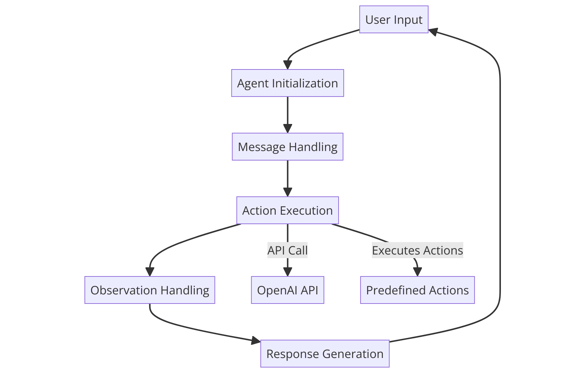

Journey into AI Development: Building a ReAct Agent with OpenAI's GPT Models

Welcome to my project! This is a journey into building a ReAct Agent from scratch using Python and OpenAI's GPT models. Here, I'll walk you through the learning experience, the fascinating architecture, and the functionalities behind this agent that integrates automation tools with large language models (LLMs).

🛠️ Technological Foundations This project utilizes some essential Python libraries:

openai: Connects to OpenAI's API to utilize the powerful gpt-3.5-turbo model.
httpx: Manages asynchronous HTTP requests, making the agent responsive and efficient.
dotenv: Securely stores and manages environment variables.
With these tools, the agent is configured to interact directly with users, dynamically adapting to their inquiries.

👨‍💻 Architecting the Agent The ReAct agent operates through an iterative response mechanism:

Message Handling: Stores and sequences both user and system messages to maintain context.
Execution: Processes messages through the GPT model to generate timely, relevant responses.
🔧 Interactive Loop Mechanics Inspired by human decision-making, the agent follows a four-step process:

Thought: Contemplates the user's query.
Action: Executes a specific action and pauses.
Observation: Evaluates the result of the action.
Answer: Provides a derived response to the user.
🛠️ Customizability and Extensions The agent features custom actions like calculate and average_dog_weight, showcasing its flexibility to handle specific tasks. This modularity allows easy tailoring of AI functionalities to suit various applications.

🔄 Enhancing Automation through Thoughtful Design To manage multi-turn dialogues seamlessly, the agent leverages:

Regex-driven action recognition: Identifies specific actions within the query.
Iterative prompts: Maintains context for multi-turn interactions, making responses precise and context-aware.
🌍 Embracing the AI Revolution This project is more than just code; it’s about leveraging AI's potential to simplify daily tasks and enable strategic automation. Through generative AI, simple scripts can evolve into sophisticated systems that simulate complex decision-making.

Let's push the boundaries together and explore the limitless possibilities of AI! Join me on this journey, and feel free to dive into the source code and experiment with the agent yourself.

